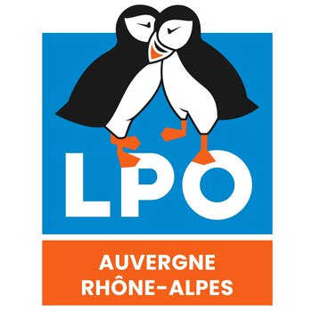

# 🐦 **Projet Bénévolat : LPO-AURA**  

  

## 📌 **Contexte et Objectif**  

LPO-AURA (Ligue pour la Protection des Oiseaux - Auvergne Rhône-Alpes) collecte des **données météorologiques** via une sonde pour suivre l'impact du climat sur la biodiversité.  

🔹 **Problème actuel :**  
- La récupération des données est **manuelle** (fichiers CSV).  
- Importation **manuelle** vers PostgreSQL.  
- Risque de **doublons et d'erreurs humaines**.  

✅ **Objectif du projet :**  
- Automatiser **l’extraction des données météorologiques** depuis l’API WEATHERLINK.  
- Stocker les données dans **PostgreSQL**.  
- Éliminer la saisie manuelle et les erreurs.  

📡 **API utilisée :** [API WEATHERLINK](https://www.weatherlink.com/)  

---

## 🛠️ **Réalisations et Méthodologie**  

### 🔹 **1️⃣ Mise en place de l’environnement**  
- Création d'un **environnement virtuel** avec **Poetry**.  
- Gestion des **clés API et accès BDD** via un fichier `.env` sécurisé.  

### 🔹 **2️⃣ Développement des scripts d'automatisation**  
Création de **trois modules Python** pour gérer les données :  
1️⃣ **Récupération de l'historique** → Téléchargement des données depuis 2021.  
2️⃣ **Mise à jour automatique** → Récupération quotidienne des nouvelles données.  
3️⃣ **Module global** → Fusion des deux scripts précédents.  

📌 **Librairies utilisées :**  
- `requests` → Connexion API.  
- `datetime` → Gestion des timestamps.  
- `psycopg2` & `sqlalchemy` → Interaction avec PostgreSQL.  
- `dotenv` → Sécurisation des identifiants API.  

### 🔹 **3️⃣ Qualité du code et bonnes pratiques**  
- Ajout des outils de **vérification automatique du code** :  
  ✔ **Black, isort** → Formatage automatique du code.  
  ✔ **Flake8, pylint** → Vérification des erreurs.  
  ✔ **pre-commit** → Exécution automatique des vérifications avant push sur GitHub.  

### 🔹 **4️⃣ Transformation en application CLI**  
Le projet a été **converti en application en ligne de commande** avec **Click**, permettant :  
- D’exécuter le script facilement (`python main.py --option`).  
- De choisir **l’intervalle de récupération des données**.  
- D’automatiser l’importation vers PostgreSQL.  

---

## 🚀 **Résultats et Avantages**  
✅ **Automatisation complète** de la récupération et de l’import des données.  
✅ **Suppression des erreurs humaines** dans le traitement des données.  
✅ **Gain de temps** dans l’intégration des données dans PostgreSQL.  
✅ **Facilité d’utilisation** grâce à l’application CLI.  

---

## 🛠️ **Technologies et Outils Utilisés**  
- **Langage** : Python 🐍  
- **Librairies** : requests, datetime, psycopg2, sqlalchemy, dotenv, click  
- **Base de données** : PostgreSQL  
- **Outils de qualité de code** : Black, isort, flake8, pylint, pre-commit  

---

## 📬 **Contact et Feedback**  

💡 Ce projet a été réalisé dans le cadre d’un **bénévolat** avec LPO-AURA. Si vous avez des suggestions ou des questions, **n’hésitez pas à me contacter** pour en discuter !  

📩 **Contact** :  
📧 [johan.rocheteau@hotmail.fr](mailto:johan.rocheteau@hotmail.fr)  
🔗 [LinkedIn](https://www.linkedin.com/in/johan-rocheteau)

